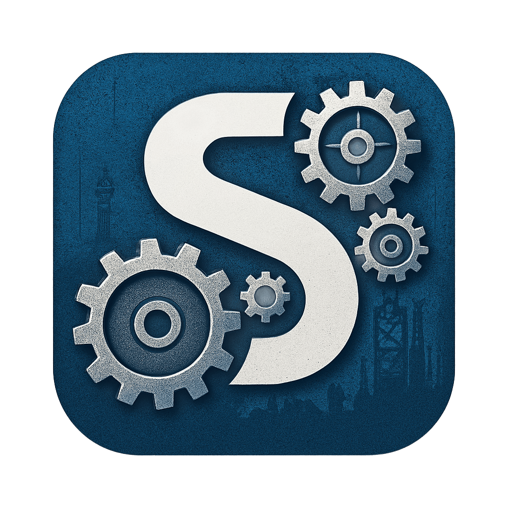
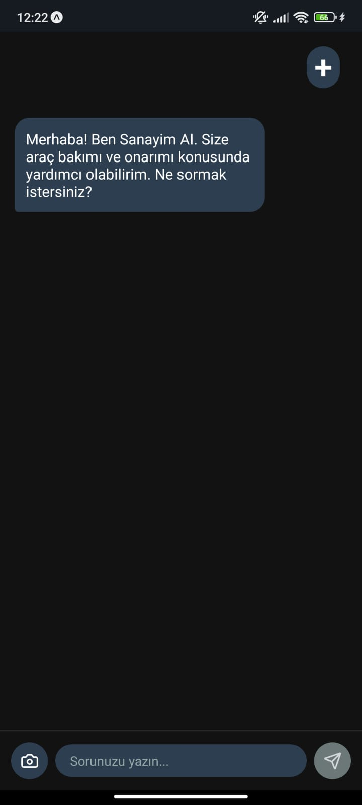
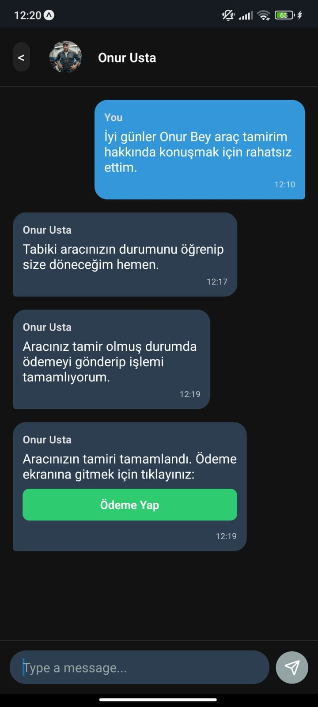
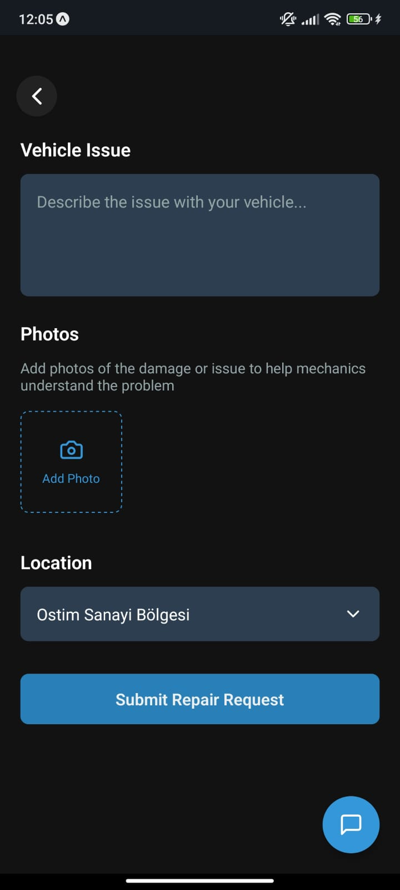
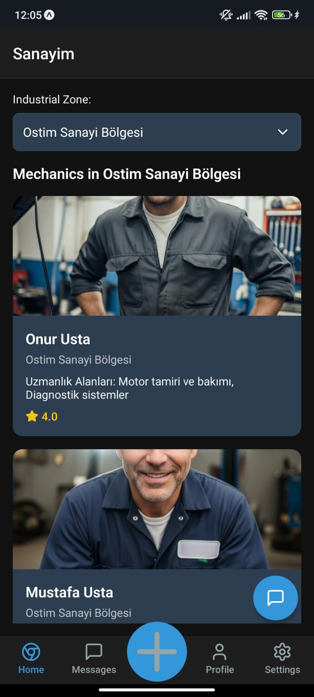
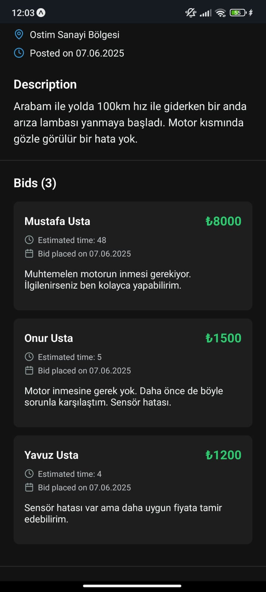
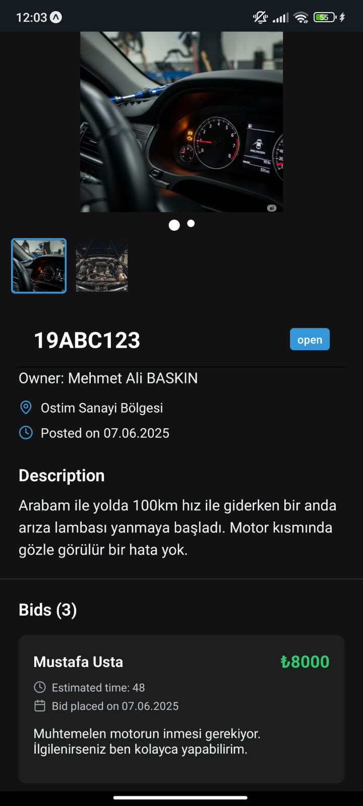
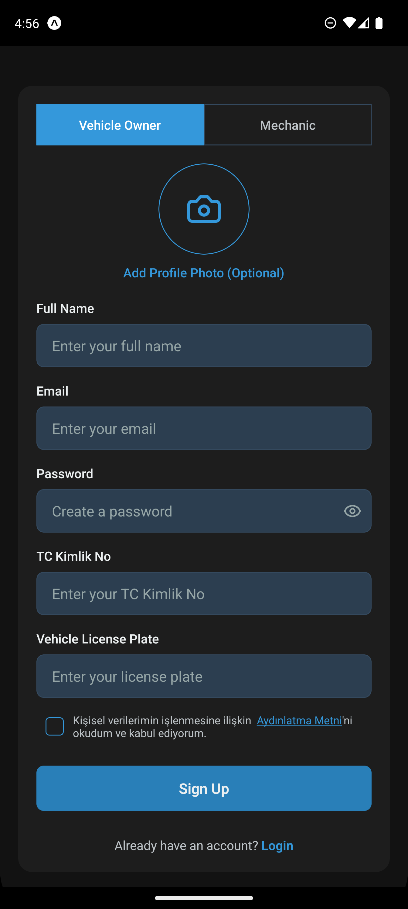
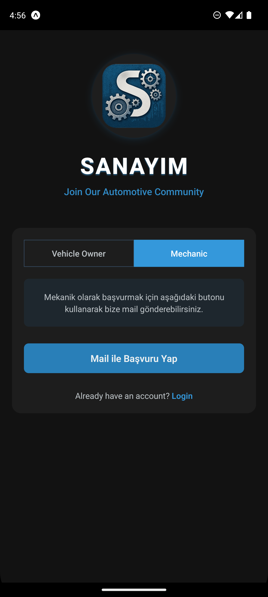

# SANAYİM

## Uygulama Özeti

**SANAYİM**, araç sahipleri ile sanayi ustalarını buluşturan mobil bir platformdur. Kullanıcılar arıza bildirimi yaparak ustalardan teklif alır; ustalar ise açık artırma yöntemiyle hizmet sunar. Yapay zekâ desteği ve güvenli altyapısıyla sektöre yenilik katmayı hedefler.

## Temel Özellikler
- Araç sahipleri için kolay arıza bildirimi
- Ustalardan hızlı ve rekabetçi teklifler
- Açık artırma ile en iyi fiyatı bulma
- Yapay zekâ destekli öneriler
- Güvenli ve kullanıcı dostu altyapı

## Ekran Görüntüleri

### 1. Yapay Zeka Chat Ekranı

### 2. Ustalarla Mesajlaşma ve Ödeme Bildirimi Gönderme Ekranı

### 3. Tamir İlanı Açma Ekranı

### 4. Ustaların Listelendiği Ana Ekran

### 5. Ustaların Yaptığı Teklifler

### 6. Tamir İlanı Detay Sayfası

### 7. Araç Sahibi Kayıt Olma Ekranı

### 8. Sanayi Ustası Kayıt Olma Ekranı

## Katkıda Bulunma
Katkıda bulunmak için lütfen bir pull request gönderin veya bir issue açın.

---

## Uygulama Tanıtım Videosu

[YouTube'da İzle](https://www.youtube.com/watch?v=H5JJ8inCPmg&ab_channel=Blitz)

